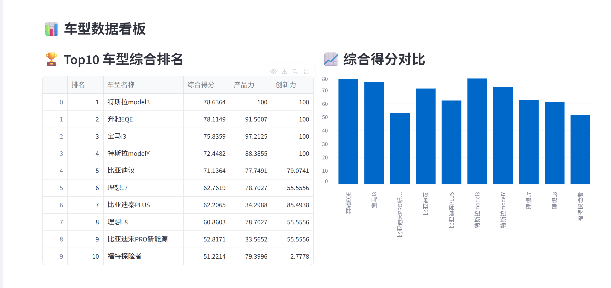
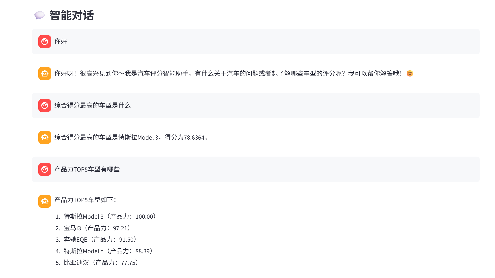
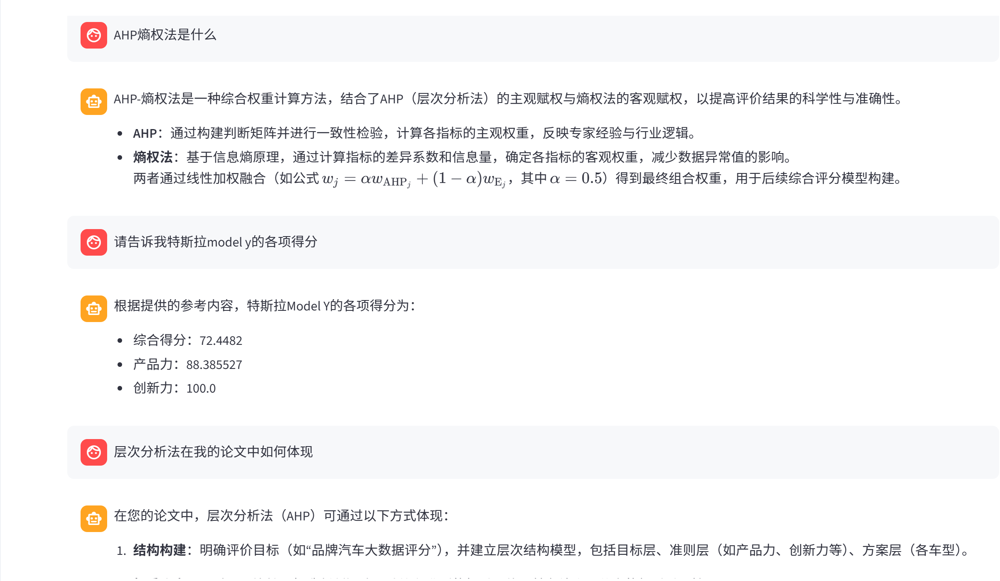
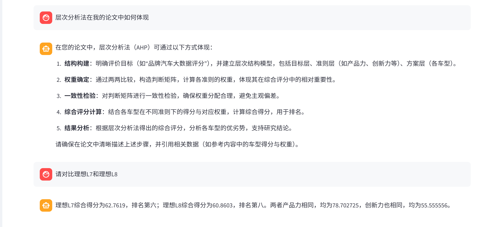
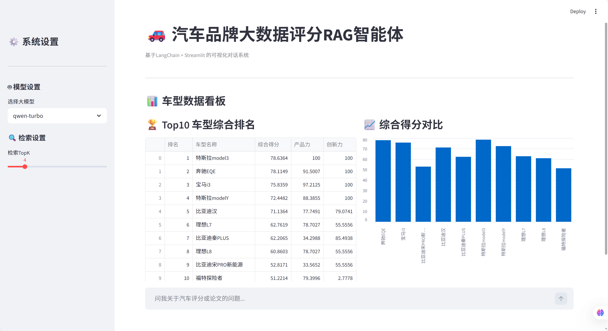

# 产品需求文档（PRD）：汽车AI评分RAG智能助手
**文档版本**：V1.0
**最后更新**：2026年4月
**产品负责人**：李俊贤
**文档状态**：正式版

---

## 一、产品概述
### 1.1 产品名称
汽车AI评分RAG智能助手

### 1.2 产品定位
国内汽车垂直领域一站式AI购车决策助手，基于AHP-熵权法客观量化评分模型、LangChain+LangGraph RAG智能体技术，整合公开汽车行业及个人毕业论文数据与车型评测知识库，为用户提供精准车型评分查询、多维度车型对比、汽车行业知识问答、数据可视化分析全流程服务，解决购车用户信息不对称、决策成本高的核心痛点。

### 1.3 核心价值
1.  **客观量化决策参考**：基于产品力、市场表现、用户口碑、创新力四大维度的AHP-熵权法评分模型，为24款主流车型提供0-100分制可量化综合评分，替代碎片化、营销化的购车信息。
2.  **一站式智能交互体验**：对话式交互替代零散工具，用户通过自然语言即可完成车型查询、对比、行业知识检索，大幅降低购车决策门槛。
3.  **专业数据能力支撑**：融合汽车垂直平台结构化参数、市场行业数据、社交媒体用户口碑等多源公开数据，保证数据的全面性、时效性与准确性。

### 1.4 产品背景
当前国内汽车市场已进入电动化、智能化高速发展期，年上市新车型超百款，消费者购车时普遍面临三大核心问题：
- 信息不对称：营销信息泛滥，用户难以获取客观、中立的车型评价；
- 评价无标准：不同平台评价维度不一，无统一、可量化的评分体系，车型对比难度大；
- 效率低下：车型参数、口碑、行业知识分散在不同平台，用户需跨平台检索，决策成本极高。

本产品针对上述痛点，打造数据驱动的AI购车助手，为用户提供全流程决策支持。

---

## 二、目标用户
|用户分层|用户画像|核心需求|
|---|---|---|
|**核心用户**|25-40岁有购车需求的普通消费者，首次购车/换车用户，对汽车专业知识了解有限|快速获取车型客观评分、排名，对比不同车型优劣势，获取中立的购车建议|
|**次要用户**|汽车行业分析师、汽车自媒体从业者、汽车经销商|快速获取车型多维度数据、行业趋势，提升内容创作与数据分析效率|
|**边缘用户**|AI产品/数据从业者、汽车爱好者|参考RAG智能体落地实践、汽车评分模型搭建逻辑，交流汽车行业知识|

---

## 三、核心痛点
### 3.1 用户端痛点
1.  信息不对称，决策易被误导：购车信息被营销内容主导，用户难以分辨信息真实性，易做出不符合自身需求的决策。
2.  无统一量化评价标准：不同平台对车型的评价维度、标准不统一，用户无法横向对比车型综合竞争力。
3.  信息获取效率低：车型参数、口碑、评测、行业知识分散在多个平台，用户需跨平台检索，耗时耗力。
4.  专业门槛高：汽车参数、技术术语专业性强，普通用户难以理解，无法判断参数对实际用车的影响。

### 3.2 行业端痛点
1.  数据分析工具零散：行业分析师需在多个平台获取数据，无一站式数据查询、可视化、分析工具。
2.  内容创作效率低：汽车自媒体需频繁检索车型数据、评测内容，无统一的知识库检索工具。

---

## 四、产品整体架构
本产品采用四层递进式架构，从上到下分别为**用户层→应用层→能力层→数据层**，架构逻辑如下：
1.  **用户层**：PC端浏览器，通过Streamlit可视化界面完成产品交互。
2.  **应用层**：核心功能模块，包含数据可视化看板、智能对话交互、知识库检索、系统设置四大核心模块。
3.  **能力层**：产品核心能力支撑，包含AHP-熵权法评分模型、RAG检索引擎、智能路由系统、工具调用引擎、大语言模型五大核心能力。
4.  **数据层**：产品数据底座，包含结构化车型评分数据库、公开汽车行业知识库两大核心数据源。

---

## 五、核心功能需求
### 5.1 模块1：汽车数据可视化看板
#### 功能描述
为用户提供车型评分数据的可视化展示，直观呈现车型综合排名、多维度得分对比，是用户进入产品的首页核心模块。

#### 用户场景
用户打开产品，快速了解当前市场综合竞争力Top10的车型，直观对比不同车型的综合得分与核心维度差异。

#### 功能详情与验收标准
|子功能|功能说明|验收标准|
|---|---|---|
|Top10车型综合排名展示|表格形式展示综合排名前10的车型，包含排名、车型名称、综合得分、产品力得分、创新力得分核心字段|1. 表格数据与底层评分数据库100%一致，无错误；2. 按综合得分降序排序，排名准确；3. 支持PC端自适应展示|
|综合得分可视化对比|柱状图形式展示Top10车型的综合得分，直观呈现车型间的得分差距|1. 柱状图与表格数据完全匹配；2. 横轴为车型名称，纵轴为综合得分，标注清晰；3. 支持hover查看具体得分数值|
|数据来源说明|页面底部标注数据来源、评分模型说明|1. 明确标注数据为公开合规的汽车行业数据；2. 简要说明AHP-熵权法评分模型的核心逻辑|

### 5.2 模块2：智能对话交互
#### 功能描述
产品核心交互模块，用户通过自然语言输入问题，产品返回精准、专业的回答，支持流式打字机输出，保留完整对话历史。

#### 用户场景
用户输入自然语言问题，如「特斯拉Model 3的综合得分是多少」「20万级家用车推荐」，快速获取精准答案。

#### 功能详情与验收标准
|子功能|功能说明|验收标准|
|---|---|---|
|自然语言问答|支持用户通过自然语言输入问题，返回对应回答|1. 支持中文输入，准确识别用户意图；2. 回答严格基于底层数据与知识库，无编造内容；3. 语言通俗易懂，符合普通用户认知|
|车型评分/排名精准查询|支持用户查询指定车型的综合得分、排名、四大维度分项得分，支持查询TopN车型排名|1. 车型数据查询准确率100%，与数据库完全一致；2. 支持模糊匹配车型名称，如输入「比亚迪汉」可准确返回对应数据；3. 支持Top5、Top10等排名查询|
|流式输出|回答采用流式打字机形式输出，提升用户交互体验|1. 回答逐字输出，无长时间空白等待；2. 输出过程无卡顿、乱码|
|对话历史记录|自动保存用户的对话历史，页面刷新后不丢失|1. 对话历史按用户-助手的顺序完整展示；2. 页面刷新、重启后历史记录不丢失|
|对话清空|支持用户一键清空当前对话历史|1. 点击清空按钮可一键删除所有对话记录；2. 清空后无残留数据|

### 5.3 模块3：RAG行业知识库检索
#### 功能描述
基于公开汽车行业及个人毕业论文知识库构建的检索引擎，用户提问涉及汽车行业知识、车型评测、购车技巧等内容时，自动触发检索，返回基于知识库的精准回答，并标注内容来源。

#### 用户场景
用户输入「新能源汽车选购核心看哪些参数」「2026年汽车行业发展趋势」，获取基于专业评测、行业报告的专业回答。

#### 功能详情与验收标准
|子功能|功能说明|验收标准|
|---|---|---|
|知识库相似度检索|基于用户问题，对知识库内容进行相似度检索，返回最匹配的TopK条内容|1. 检索响应时间≤3秒；2. 检索内容与用户问题匹配度≥90%；3. 支持用户自定义调整检索TopK参数（1-20）|
|来源标注|回答中标注内容的来源文档名称，保证内容可溯源|1. 所有引用知识库的内容均标注来源；2. 标注清晰，用户可明确知晓内容出处|
|知识库更新|支持新增公开汽车行业文档，自动更新向量库|1. 新增PDF文档后，可自动完成文本分块、向量嵌入、入库；2. 新增内容可被正常检索到|

### 5.4 模块4：智能路由与工具调用
#### 功能描述
产品核心逻辑模块，自动识别用户问题的意图，分配对应的处理逻辑，保证回答的精准性与效率，避免大模型编造数据。

#### 用户场景
用户输入的问题涉及车型数据时，自动调用工具查询结构化数据库；涉及行业知识时，自动触发RAG检索；闲聊类问题直接友好回复，无需调用额外能力。

#### 功能详情与验收标准
|子功能|功能说明|验收标准|
|---|---|---|
|意图自动识别|基于用户问题关键词，自动识别三类意图：车型数据查询、行业知识检索、闲聊交互|1. 意图识别准确率≥95%；2. 识别逻辑稳定，无异常跳转|
|工具自动调用|识别到车型数据查询意图时，自动调用对应工具，从结构化数据库中获取精准数据|1. 工具调用成功率100%；2. 数据返回准确，无遗漏、无错误|
|路由逻辑分配|严格按照「车型数据→工具调用、行业知识→RAG检索、闲聊→直接回复」的逻辑分配处理路径|1. 路由逻辑稳定，无错配、漏配；2. 不同路由的处理逻辑完全隔离，互不干扰|

### 5.5 模块5：系统设置
#### 功能描述
为用户提供产品核心参数的自定义设置功能，满足不同用户的使用需求。

#### 功能详情与验收标准
|子功能|功能说明|验收标准|
|---|---|---|
|大模型切换|支持用户切换不同版本的通义千问大模型（qwen-turbo、qwen-plus、qwen-max）|1. 切换后实时生效；2. 不同模型的调用正常，无报错|
|检索参数调整|支持用户通过滑块调整RAG检索的TopK参数，范围1-20，默认值4|1. 滑块调整流畅，参数实时生效；2. 调整后检索结果同步变化，符合参数设置|
|版本说明|展示产品当前版本、核心功能、更新日志|1. 版本信息清晰准确；2. 更新日志与产品迭代进度一致|

---

## 六、非功能需求
### 6.1 性能需求
1.  页面加载时间≤2秒，无长时间白屏；
2.  对话响应时间≤5秒，其中工具调用响应≤3秒，RAG检索响应≤3秒；
3.  系统支持同时在线用户数≥100人，无卡顿、无崩溃。

### 6.2 准确率需求
1.  车型结构化数据查询准确率100%，无编造、无错误；
2.  RAG检索内容与用户问题匹配度≥90%，无答非所问；
3.  意图识别与路由分配准确率≥95%，无错配。

### 6.3 易用性需求
1.  零学习成本，用户无需专业知识，打开产品即可快速上手；
2.  界面布局清晰，核心功能突出，无冗余操作；
3.  交互逻辑符合用户使用习惯，无反人类设计。

### 6.4 兼容性需求
1.  支持主流PC端浏览器访问，包括Chrome、Edge、Firefox、Safari；
2.  支持不同分辨率的PC屏幕自适应展示，无布局错乱。

### 6.5 安全性需求
1.  大模型API密钥通过加密方式存储，不泄露、不硬编码在代码中；
2.  所有数据源均为公开合规内容，无版权风险、无侵权内容；
3.  不收集、不存储用户的个人隐私信息，对话历史仅存储在用户本地会话中。

---

## 七、核心业务规则
### 7.1 评分模型规则
1.  评分体系采用四层递进式结构：目标层（综合竞争力评分）→准则层（4个一级指标）→指标层（11个二级指标）→数据层；
2.  一级指标包含4个维度：产品力、市场表现、用户口碑、创新力，权重通过AHP-熵权法主客观组合赋权计算得出；
3.  评分采用0-100分制，得分越高代表车型综合竞争力越强，按综合得分降序进行排名；
4.  所有指标均有明确的量化规则，无模糊定性评价，数据均来自公开合规平台，评分流程可复现、结果可验证。

### 7.2 智能路由规则
1.  用户问题包含「得分、排名、最高、第一、Top、对比、车型、汽车、比亚迪、特斯拉、理想、蔚来」等关键词，判定为车型数据查询意图，路由至工具调用逻辑；
2.  用户问题包含「选购、评测、行业、趋势、参数、技巧」等关键词，判定为行业知识检索意图，路由至RAG检索逻辑；
3.  不满足上述两类的问题，判定为闲聊交互意图，路由至直接回复逻辑。

### 7.3 数据来源规则
1.  结构化评分数据：来自汽车之家、易车等汽车垂直平台公开的车型参数、销量、保值率数据，以及社交媒体公开的用户口碑数据；
2.  知识库数据：来自公开可免费使用的汽车行业报告、车型评测报告、行业公开资讯，无版权风险，非商用场景合规使用。

---

## 八、迭代规划
### V1.0 版本（当前上线版本）
- 核心交付：数据可视化看板、智能对话交互、RAG行业知识库检索、智能路由与工具调用核心功能上线；
- 核心目标：完成产品MVP落地，满足用户核心的车型查询、购车决策需求。

### V1.1 版本（迭代规划）
- 新增功能：多车型横向对比、车型收藏、用户自定义评分权重、车型筛选（按价格、级别、能源类型）；
- 核心目标：丰富产品功能，提升用户个性化使用体验。

### V2.0 版本（长期规划）
- 新增功能：车型库扩充至100+款、用户购车需求智能匹配、批量数据导出、行业分析报告自动生成、移动端适配；
- 核心目标：覆盖全量主流车型，满足个人用户与行业用户的全场景需求，打造汽车垂直领域标杆AI工具。

---

## 九、风险与应对方案
|风险类型|风险描述|应对方案|
|---|---|---|
|数据风险|车型数据更新不及时，与市场最新情况脱节|1. 建立季度数据更新机制，定期同步最新车型数据；2. 标注数据更新时间，明确告知用户数据周期|
|技术风险|大模型API接口异常，导致产品无法正常使用|1. 增加接口异常兜底方案，接口异常时友好提示用户；2. 预留备用大模型接口，支持快速切换|
|合规风险|知识库内容存在版权风险|1. 严格筛选知识库内容，仅使用公开可免费商用的文档；2. 标注所有内容来源，如有版权方投诉，第一时间下架对应内容|

---

## 十、术语解释
1.  **AHP-熵权法**：一种主客观组合赋权的综合评价方法，结合层次分析法（AHP）的专家经验与熵权法的数据客观规律，计算指标的组合权重，保证评价结果的科学性与准确性。
2.  **RAG**：检索增强生成（Retrieval-Augmented Generation），通过检索外部知识库获取精准内容，再基于检索内容生成回答，有效解决大模型幻觉、知识滞后的问题。
3.  **智能路由**：基于用户问题意图，自动分配最优的处理逻辑，提升回答准确率与系统响应效率。
4.  **流式输出**：大模型生成回答时，逐字逐句向用户展示生成内容，而非等待全部内容生成后一次性展示，大幅提升用户交互体验。

---

## 十一、界面原型展示
> 原型截图存放路径：`docs/prototype/` 文件夹内

### 1. 数据看板页

### 2. 智能对话交互

### 3. 主界面概览
